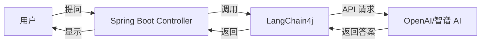
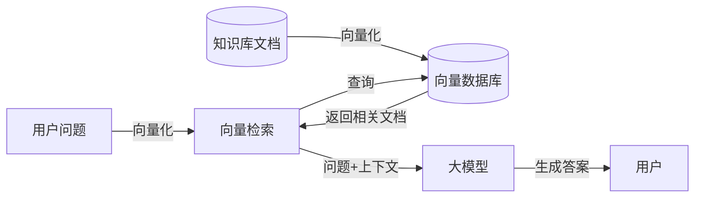
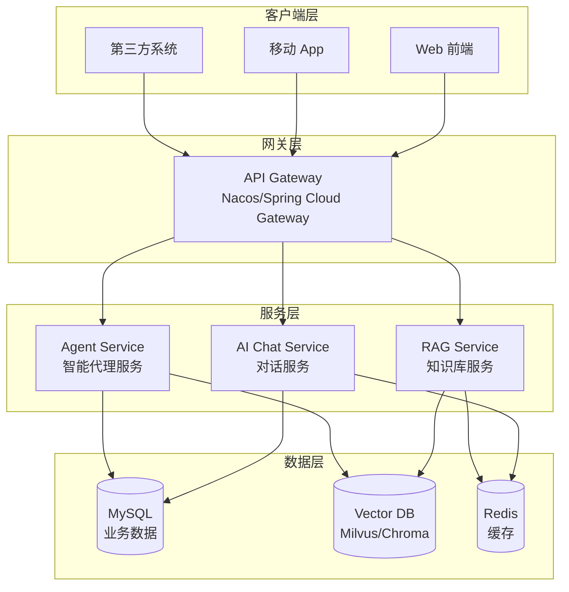
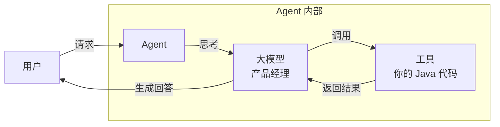

# Java 后端如何转型 AI 应用开发 — 从 CRUD 到 AI，其实没你想的那么难

## 开头聊几句

嘿，Java 老伙计！咱们认识一下，我也是写了多年 Java 的老 CRUDer。你是不是跟我一样：Spring 玩得滚瓜烂熟，微服务架构能扯半天，SQL 优化遇到过的坑能写一本书，每天不是改需求就是排线上问题？

然后突然有一天，你刷公众号、刷知乎，发现所有人都在聊 AI、大模型、RAG、Agent……你心里开始犯嘀咕："我这一身 Java 本领，不会说过时就过时了吧？"

**说实话，我当初也慌。但摸索了一圈发现—根本不用慌！** 你的 Java 技能不仅没过时，反而比那些只会调 Python 的新手值钱多了。这篇文章就是我踩过坑之后整理的，从一个 Java 后端老兵的角度，聊聊怎么平滑转型 AI 开发。

---
## 一、先给你吃颗定心丸：你的 Java 经验真的很值钱

说真的，我见过太多文章把 AI 吹得玄乎，好像不是 CS 科班出身、不懂深度学习就别碰。那都是瞎扯。

**AI 应用开发不是让你去从头训练大模型，那是算法博士的事儿。咱们做应用开发的，就是用现成的大模型 API，搭出能用的产品。**

你的那些老经验，哪一样没用？

- ✅ 后端架构设计，你不会—AI 应用搭出来也是一团糟
- ✅ 微服务拆分经验，做大型 AI 项目照样用得上
- ✅ SQL 调优能力。

RAG 里向量检索也需要优化思维
- ✅ API 设计功底，给别人用的 AI 服务照样需要好接口
- ✅ 线上稳定性保障，哪一个线上应用不需要？

说白了，**AI 应用开发 = 你熟悉的 Java 后端 + 一个会"说话"的大模型**。就这么简单。以前你写业务逻辑，现在只不过是把一部分逻辑交给大模型来做而已。

---
## 二、选择困难症看这里：我帮你挑好了技术栈

作为 Java 开发者，一搜 AI 开发，各种框架满天飞，是不是看得眼花缭乱？我帮你筛过了，对于 Java 后端来说，**性价比最高**的就是这个组合：

### 核心框架
- **Spring Boot** — 不用换，你已经很熟了，接着用
  - 版本要求 3.5+，Spring Boot 3.x 就行
- **LangChain4j** — Java 版的 LangChain。

对 Java 开发者太友好了（真心推荐）
  - 需要 JDK 17+，**强烈建议 JDK 21**，虚拟线程跑异步 AI 调用真的爽
  - Spring Boot 集成要求 3.5+，正好契合
- **Spring AI** — Spring 官方出的，备选。看你个人喜好

### AI 大模型服务
- **OpenAI API** — 目前最成熟，效果最好，预算够直接上
- **国内替代**：智谱 AI、通义千问、文心一言 — 懂得都懂，不用翻墙，便宜

### 向量数据库（做 RAG 需要）
- **Milvus** / **Chroma** / **PGVector** — 选一个就行。新手推荐 Chroma，够简单

**我的推荐组合：** `Spring Boot + LangChain4j + OpenAI（或国内替代）+ Milvus/Chroma`

就这个组合，直接开干，不用纠结。

---
## 三、五分钟跑通第一个 AI 应用：比写 CRUD 还简单

咱们直接动手，用 Spring Boot 集成 LangChain4j 做一个最简单的 AI 助手。我敢说，这比你从零写一个用户 CRUD 接口还要快。

### 整体架构图（一看就懂）



### 第一步：加依赖

```xml
<!-- LangChain4j Spring Boot Starter -->
<dependency>
    <groupId>dev.langchain4j</groupId>
    <artifactId>langchain4j-spring-boot-starter</artifactId>
    <version>1.11.0-beta19</version>
</dependency>

<!-- OpenAI 集成（想用其他模型就换对应的 starter） -->
<dependency>
    <groupId>dev.langchain4j</groupId>
    <artifactId>langchain4j-open-ai-spring-boot-starter</artifactId>
    <version>1.11.0-beta19</version>
</dependency>

<dependency>
    <groupId>org.springframework.boot</groupId>
    <artifactId>spring-boot-starter-web</artifactId>
</dependency>
```

### 第二步：配置一下 API
在 `application.yaml` 里加几行配置：

```yaml
langchain4j:
  open-ai:
    chat-model:
      base-url: ${OPENAI_URL}
      api-key: ${OPENAI_API_KEY}
      model-name: ${OPENAI_MODEL_NAME}
      temperature: 0.7
      max-tokens: 2048
      log-requests: true
      log-responses: true
```

### 第三步：定义 AI 服务

就一个接口。加个注解，搞定：

```java
@AiService
public interface MyAssistant {

    @SystemMessage("You are a polite assistant")
    String chat(String userMessage);

}
```
### 第四步：写个 Controller

```java
@RestController
class AssistantController {
    @Autowired
    MyAssistant assistant;

    @GetMapping("/chat")
    public String chat(String message) {
        return assistant.chat(message);
    }

}
```

**没了！真的没了！** 启动项目，访问 `http://localhost:8080/chat?message=你好`，大模型就直接给你回答了。

是不是比你写 CRUD 还快？我当初第一次跑通的时候，都不敢相信这么简单。
---
## 四、进阶：做个 RAG 知识库，这玩意儿真能解决实际问题

RAG（检索增强生成）是目前来说，**最容易落地、最能解决实际问题**的 AI 场景了。我用 Java 后端的话给你解释，你一下就能懂：RAG 本质上就是 **查询 + 拼上下文 + 生成答案**，跟你平时写业务代码思路一模一样。



换个你更熟悉的类比：

```
用户问题 → 向量检索（类比你写的 SQL WHERE）→ 找到相关文档（类比查出来数据）→ 
拼到 Prompt 里（类比你组装业务数据）→ 大模型生成答案（类比返回给前端）
```

看。是不是跟你每天写的业务逻辑没啥区别？只是存储从 MySQL 换成了向量数据库而已。

### 核心概念（人话翻译）
- **向量化**：把文字转换成一堆数字，让计算机能理解"相似度"
- **向量数据库**：专门存向量，能快速找出相似内容（就是干这个活的）
- **Prompt Engineering**：说白了就是怎么给大模型"说清楚需求"

### 推荐写法：LangChain4j 优雅整合 RAG

LangChain4j 已经帮你把所有脏活累活都干了，你只需要几行配置就能搞定：
```java
@Configuration
public class AiConfig {

    @Bean
    public AiAssistantService knowledgeAssistantService(
            ChatModel chatModel,
            StreamingChatModel streamingChatModel。
            ContentRetriever contentRetriever) {
        
        // 1. 会话记忆：每个会话记住最近 10 条对话
        ChatMemory chatMemory = MessageWindowChatMemory.withMaxMessages(10);

// 2. 组装 AI 服务，自动整合 RAG
        return AiServices.builder(AiAssistantService.class)
                .chatModel(chatModel)
                .streamingChatModel(streamingChatModel)
                .chatMemory(chatMemory)
                // 支持多用户隔离。

每个用户独立记忆
                .chatMemoryProvider(memoryId -> 
                        MessageWindowChatMemory.withMaxMessages(10))
                // 这里就是 RAG。自动检索相关文档放进上下文
                .contentRetriever(contentRetriever)
                .build();
    }
}
```

### 导入知识库文档：一行代码帮你全搞定
LangChain4j 连文档加载、分词、向量化、存储都帮你写好了：

```java
@Service
public class DocumentIngestionService {

    @Autowired
    private EmbeddingStore embeddingStore;

    /**
     * 批量导入知识库文档
     * 自动完成：文档加载 → 切分文本 → 向量化 → 存到向量数据库
     */
    public void ingestDocuments() {
        // 加载本地目录下的所有文档（支持 PDF/Word/Markdown/Text）
        List<Document> documents = FileSystemDocumentLoader.loadDocuments(
                "src/main/resources/docs");
        
        // 一键导入，剩下的交给 LangChain4j
        EmbeddingStoreIngestor.ingest(documents, embeddingStore);
    }
}
```

就这么简单，你的知识库系统就做好了。用户问问题，自动找相关文档，然后给你回答，不用担心大模型胡编乱造。
---
## 五、微服务架构怎么玩？还是你熟悉的那一套

做项目嘛，长大了肯定要拆微服务。这一块可是咱们 Java 后端的老本行了，AI 应用也一样，该怎么拆还是怎么拆。



每个服务都是 Spring Boot。那一套你熟悉的东西照样用：
- 服务发现用 Nacos/Eureka，没变
- 配置中心用 Apollo/Nacos Config，没变
- 调用链追踪用 Skywalking，没变
- 日志收集用 ELK，没变

是不是瞬间感觉回到舒适区了？AI 没那么玄乎，就是多了一种服务而已。
---

## 六、AI Agent 是什么？别被名词唬住了，其实很简单
现在 AI Agent 炒得很热，各种文章吹得神乎其神。作为 Java 后端，咱们不整虚的，用大白话给你讲明白。



**一句话讲明白：** Agent = 大模型 + 工具 + 记忆。大模型负责"思考"，你的 Java 代码负责"干活"。

类比一下更好懂：
- 大模型 = 产品经理 — 能听懂需求，知道该做什么
- 工具 = 你的 Java 代码 — 真刀真枪干实事。查数据算东西
- Agent = 产品经理 + 开发 — 两个人配合把活干了

### 举个例子：把你的 Java 代码变成 Agent 工具
其实超级简单，就加一个注解就行，大模型自己就能看懂你的工具是干嘛的。

#### 例子 1：整个简单的计算器工具
```java
@Component
public class CalculateTool {

    /**
     * 计算两个数字的和
     * @param a 第一个数字
     * @param b 第二个数字
     * @return 两数之和
     */
    @Tool("Sums 2 given numbers")
    public double sum(double a, double b) {
        return a + b;
    }

    /**
     * 计算平方根
     * @param x 输入数字
     * @return 平方根
     */
    @Tool("Returns a square root of a given number")
    public double x is;
    return Math.sqrt(x);
    }
}
```

#### 例子 2：把你现有的业务接口变成工具
```java
@Component
public class OrderQueryTool {
    
    @Autowired
    private OrderService orderService;
    
    /**
     * 查询订单信息
     * @param orderId 订单号
     * @return 订单详情
     */
    @Tool("查询订单信息。参数为订单号")  // 告诉大模型这工具干嘛的
    public String queryOrder(@P("订单号") String orderId) {
        Order order = orderService.getOrderById(orderId);
        return order != null ? order.toString() : "订单不存在";
    }
}
```

### 把工具注入到 AI Service 里就能用了
```java
@Configuration
public class AiConfig {

    @Bean
    public AiAssistantService aiAssistantService(
            ChatModel chatModel,
            CalculateTool calculateTool,
            OrderQueryTool orderQueryTool) {
        
        return AiServices.builder(AiAssistantService.class)
                .chatModel(chatModel)
                .chatMemory(MessageWindowChatMemory.withMaxMessages(10))
                // 注入工具，大模型自动会用
                .tools(calculateTool, orderQueryTool)
                .build();
    }
}
```

### 实际用起来是什么效果？

用户一问，大模型自己判断要不要调用工具：
- 用户问："123 加 456 等于多少？

" → 自动调用 `calculateTool.sum(123, 456)`
- 用户问："帮我查一下订单 12345 状态" → 自动调用 `orderQueryTool.queryOrder("12345")`
- 用户问："16 的平方根是多少？" → 自动调用 `calculateTool.squareRoot(16)`

整个过程你不用写一句判断逻辑，大模型自动搞定：**思考→选工具→调用工具→生成回答**。

看到没？你不需要把现有代码都重写，只要把业务逻辑封装成"工具"，Agent 就能直接用。你的 Java 经验，在这儿体现得淋漓尽致。

---

## 七、给新手的学习建议：别瞎学，按这个路子走
我踩过一些坑，给你总结一下最快的学习路径：

1. **先从 LangChain4j 入手** — 文档写得好，对 Java 工程师特别友好。

别一开始就去啃 LangChain（那是 Python 的）
2. **先做一个简单的 RAG 应用** — RAG 是真能落地，做完你就懂核心概念了
3. **结合你自己的业务** — 用 AI 解决你工作中实际遇到的问题，比如帮你写文档、生成代码。进步最快
4. **边学边输出** — 写博客、做开源，写一遍比你看十遍记得牢

**时间规划参考：**
- 第一周：跑通 Spring Boot + LangChain4j 入门 Demo
- 一个月内：做完一个能用的 RAG 应用
- 三个月内：试着做一个带工具调用的 Agent

---
## 最后说两句：别等了。现在就动手吧

Java 后端转型 AI 应用开发，**不是让你扔掉之前的本领重新学**，而是在你现有的技能树上多开一条分支而已。

你的 Spring 经验、微服务经验、架构设计能力，这些都是 AI 应用开发中非常值钱的东西。AI 不是来抢你饭碗的，是来给你升级的。

**记住：**
- 你不需要变成 AI 算法专家
- 你要做的是"会用 AI 的 Java 后端工程师"
- 这俩真不是一回事

从今天开始，写你的第一行 AI 代码吧！就从那个最简单的 Spring Boot + LangChain4j 开始，真的五分钟就能跑通。

干就完了！

---
*作者：mordan*